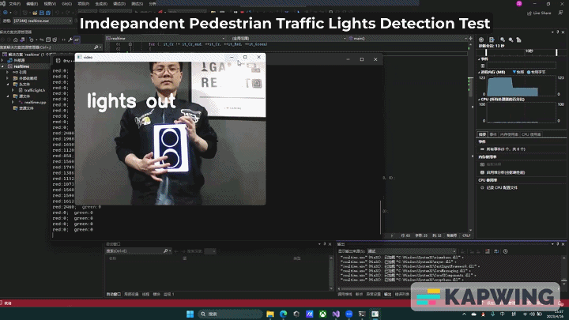
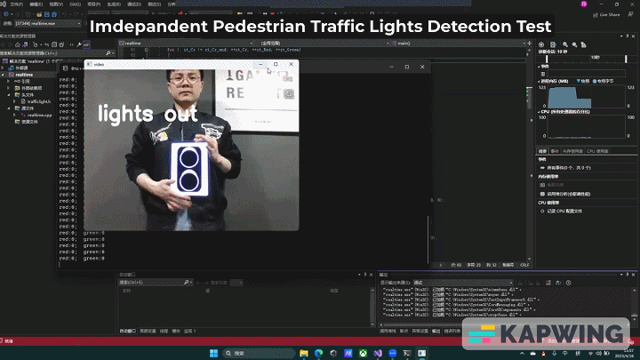

# Walking-Assistance-for-the-Blind

The purpose of this project is to make a device that assists the blind to walk. It uses computer vision to identify traffic lights and gives corresponding vibration or sound feedback to inform the traffic lights at the current intersection. The further objective is adding the function of fall detection and alarm.

## Social Media
[Youtube][(Click Here)](https://youtu.be/rab-Rcky8Bs)


## 1.Install required libraries

 ### 1.1 OpenCV
 
  #### Step1 Download opencv
 ```cpp
 git clone https://github.com/opencv/opencv.git
 ```
  
 #### Step2 Install related dependencies
  ```cpp
  sudo apt-get install cmake
  sudo apt-get install build-essential libgtk2.0-dev libavcodec-dev libavformat-dev libjpeg-dev libswscale-dev libtiff5-dev
  sudo apt-get install libgtk2.0-dev
  sudo apt-get install pkg-config 
  ```
 #### Step3 Configure the installation path and compile
  ##### Open the path to the OpenCV installation
   ```cpp
   cd /home/team34/opencv
   ```
  ##### Compile
  ```cpp
  mkdir build
cd build
cmake -DCMAKE_BUILD_TYPE=Release -DOPENCV_GENERATE_PKGCONFIG=ON -DCMAKE_INSTALL_PREFIX=/usr/local ..
sudo make
sudo make install
```
#### Step4 Configure the OpenCV environment
```cpp
cd /etc/ld.so.conf.d/
sudo touch opencv4.conf
sudo sh -c 'echo "/usr/local/lib" > opencv4.conf'
sudo ldconfig
sudo cp -f /usr/local/lib64/pkgconfig/opencv4.pc  /usr/lib/pkgconfig/
```
##### Add environment variables
```cpp
sudo vim /etc/bash.bashrc
sudo apt-get install vim
```
##### Add at the end of the file
```cpp
PKG_CONFIG_PATH=$PKG_CONFIG_PATH:/usr/lib/pkgconfig
export PKG_CONFIG_PATH
```
##### Test
```cpp
pkg-config --modversion opencv4
```
#### Step5 Program run verification
##### This is a program that directly calls the camera and requires an external camera on the Raspberry Pi
```cpp
#include <opencv2/imgcodecs.hpp>
#include <opencv2/highgui.hpp>
#include <opencv2/imgproc.hpp>
#include <iostream>
 
using namespace cv;
using namespace std;
 
int main()
{
	VideoCapture cap(0);
	Mat img;
	while (true)
	{
		cap.read(img);
		imshow("Image", img);
		waitKey(1);
	}
    return 0;
}
```
 ##### Compile
 ```cpp
 cmake .
 make
 ./test
 ```
### 1.2 WiringPi
#### Download and install
```cpp
wget https://project-downloads.drogon.net/wiringpi-latest.deb
sudo dpkg -i wiringpi-latest.deb
```
##### Check if wiringPi is installed successfully
```cpp
gpio -v
```
##### Enter the command below and it will read all accessible pins and print a table of their pin numbers (wiringPi and BCM_GPIO, corresponding to the diagram), along with their modes and values.
```cpp
gpio readall
```
## 2.Hardware introduction
#### 8MP Raspberry Pi Camera Board -  RPI 8MP CAMERA BOARD
The Raspberry Pi camera module v2 is a small add-on board for Raspberry Pi, featuring a fixed focus lens and a high quality 8 megapixel Sony IMX219 image sensor. It can take static images of 3280 x 2464 pixels and can capture video at 1080p30, 720p60 and 640x480p90 resolutions. The camera connects to Raspberry Pi via a short ribbon cable and uses the dedicated CSi interface. The camera is lightweight and small, making it suitable for mobile or other applications where size and weight are important. The camera module can be used in various applications, including CCTV security camera, motion detection, and time lapse photography. All software is supported within the latest version of Raspbian Operating System.
#### Grove Vibration Motor
The Grove - Vibration Motor is a compact and easy-to-use module consisting of a coin-type, permanent magnet coreless DC motor. It vibrates when the input logic is HIGH, providing a way to notify the user. It has a small size of 24mm x 20mm, making it easy to embed into your project. The module features a Grove-compatible interface, allowing for simple connection with Arduino boards without requiring soldering. It is also compatible with Raspberry Pi. The module's dimensions are 24mm x 20mm x 9.8mm.
#### 3 Wire 3 Pins 3.3V - 5V Alarm Active Buzzer Sensor Module Arduino Raspberry Pi
This module is a small buzzer designed for the Sensor Shield that allows you to create different sounds based on the frequency of I/O toggling. By plugging the buzzer module into the Sensor Shield and specifying the pin, frequency, and duration, you can play melodies with your Arduino/Chinduino. The module uses an 8550 or 9012 transistor driver and operates at 3.3V - 5V. It has a fixed bolt hole for easy installation and can be connected to external microcontroller IO ports through its VCC, GND, and I/O wires. The module's PCB size is 3.3cm x 1.3cm.
#### Fermion: BMA220 Digital Triaxial Acceleration Sensor (Breakout) (±16g)
The Triple Axis Accelerometer with Bosch BMA220 is a breakboard sensor with an ultra-small size of 2mm x 2mm, designed for low power consumption applications. It has SPI and I2C interfaces and can measure accelerations in 3 perpendicular axes, enabling it to sense tilt, motion, shock, and vibration. This sensor is ideal for use in mobile devices, handhelds, computer peripherals, man-machine interfaces, virtual reality features, and game controllers. It has many configurable features that allow for flexibility in integrating the sensor into various systems. The recommended power supply is 3.3V, and the sensor can be used with Arduino controllers. Its specifications include an acceleration range of ±2g/±4g/±8g/±16g, LED power indication, and a compact and easy-to-use design with a size of 13x22mm (0.51x0.87").
#### Gravity: LED Button - Blue
This is a switch button with a transparent cap and an internal LED that lights up when the button is pressed down. The button can be used with micro:bit for various interactive projects, and the module outputs a high signal when the button is pressed down, and a low signal when released. The button can operate on a voltage of +3.3-5V, and comes with a PH2.0-3P connector. It has a dimension of 27×26.5mm/1.06×1.04”, and is available in colors of red, yellow, green, blue, and white.
### Hardware architecture


## 3.Software debugging
This is a traffic signal recognition program that uses the OpenCV library to process video images and detect red and green traffic lights in the image. The main process is as follows:
 1. Read camera image
 2. Adjust image brightness
 3. Convert the image from BGR color space to YCrCb color space
 4. Split red and green based on the Cr component
 5. Dilate and erode the separated red and green channels respectively
 6. Use contour detection method to detect red and green regions and calculate their pixel area
 7. Determine the color of the traffic signal based on the size relationship of the red and green pixel areas
 8. Mark the detected traffic signal color in the original image and display the video in real-time.
And according to the recognition results, control the vibration motor and buzzer. When the result is a red light, the motor vibrates, and when the result is a green light, the buzzer works.


The accelerometer part of the code is used to read acceleration values from a connected BMA220 accelerometer sensor through the I2C communication protocol and detect if a fall-down event occurs based on the acceleration data.
The code starts by including necessary libraries and defining constants for the sensor's I2C address and scale factor. It initializes the I2C communication and sets the sensor to normal mode with a data output rate of 100Hz.
The main loop of the code continuously reads acceleration values from the sensor using specific register addresses and converts the raw data to gravity acceleration units. It then calculates the magnitude of acceleration and subtracts 1g (acceleration due to gravity) from it. If the resulting value is greater than 1.9g, it outputs a warning message indicating that a fall-down event is detected. Otherwise, it outputs a message indicating no fall-down event is detected.
The code can be extended to control other devices or take further actions when a fall-down event is detected, such as vibrating a motor and activating a buzzer to attract the attention of others and seek help. Additionally, a reset button is set up to restart the program by long-pressing it for three seconds, in case of false alarms.

